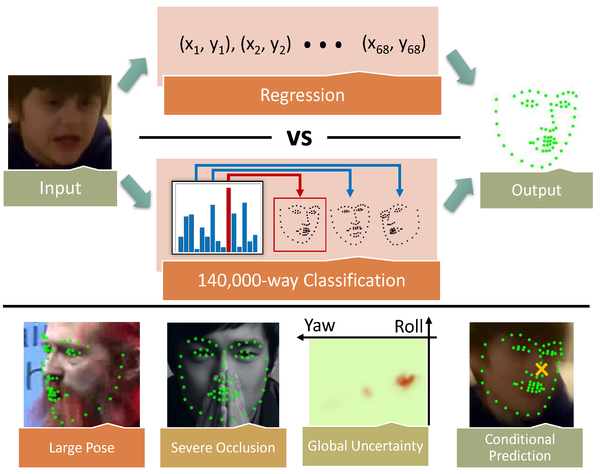
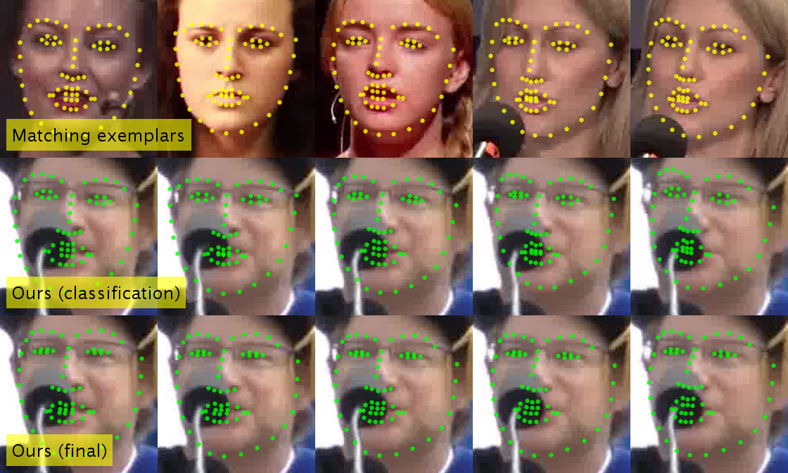

# Brute-Force Facial Landmark Analysis

[[arXiv]](https://arxiv.org/abs/1802.01777)




## Dependency
* VLFeat
* MatConvNet (tested with commit [d62881db](https://github.com/vlfeat/matconvnet/tree/d62881dbb587e4d5ed6750549b6a6b3f7559c84f))

## Usage
1. Download the [pre-trained model](https://drive.google.com/file/d/1oTRRsYseMnIXWiBR-OODuYm1I3NgdDvQ/view?usp=sharing) and extract to `models/`
2. Run `Test.m`

## Face detection

The detection for the example images are provided. However, to run on new images, a face detector is required. We recommend using [MTCNNv2](https://kpzhang93.github.io/MTCNN_face_detection_alignment/) due to its robustness and stability. Also, our detection refinement module is trained with MTCNNv2 using its default parameters.

The accepted format of the bounding box is [x y width height] (no need to round to integer), different from the output of the `detect_face` function in MTCNNv2. It can be transformed using the follow code:

```
bbx(:, 3:4) = bbx(:, 3:4) - bbx(:, 1:2);
```

## Videos
* [Temporal smoothing under complete occlusion (provided detection)](doc/HMM.mp4)
* [Interactive conditional prediction - nose tip](doc/Interactive-Nose.mp4)
* [Interactive conditional prediction - eye corner](doc/Interactive-Eye.mp4)

## Citation
If you use this code for your research, please cite the paper:

```
@article{BFFL2018,
  title={Brute-Force Facial Landmark Analysis With A 140,000-Way Classifier},
  author={Li, Mengtian and Jeni, Laszlo and Ramanan, Deva},
  journal={AAAI},
  year={2018}
}
```